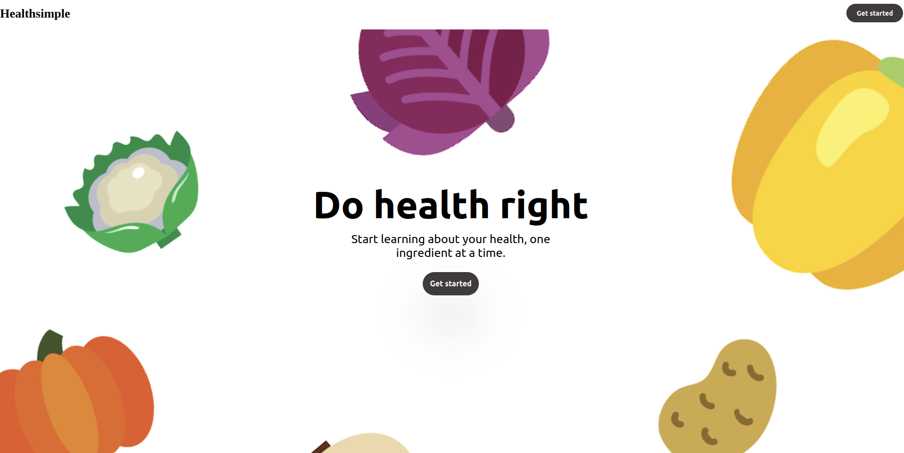

# Healthsimple Hackwestern 9 submission

## How it works?
Developed with a react frontend, a flask backend and coheres nlp technology which is used to generate nutrition summaries
## User story:
A user wants to know which nutrients are missing or having too much of in their diet. HealthSimple provides the user with their macronutrients score and a summarization of the benefits or drawbacks of each ingredient, as well as a summary of an article that concerns their macronutrients deficiency.  

## Nutrition score focused on macro: 
Protein: essential amino acids: 
Fat: fat source quality 
Carbs: index on the glycemic index

## Use case: 
User puts in what they have in their meal, and the application provides them with a nutrtion score based on ingredient quality along with feedback generates via machine learning through coheres nlp tech

